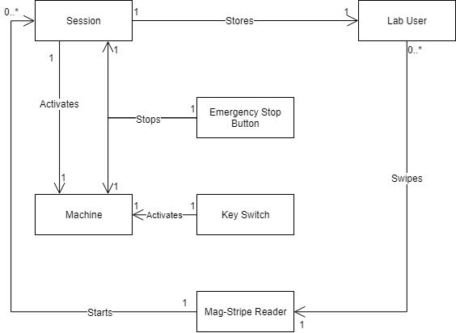
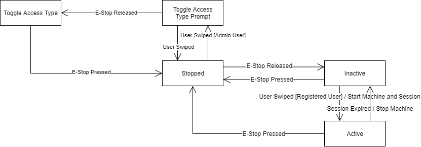
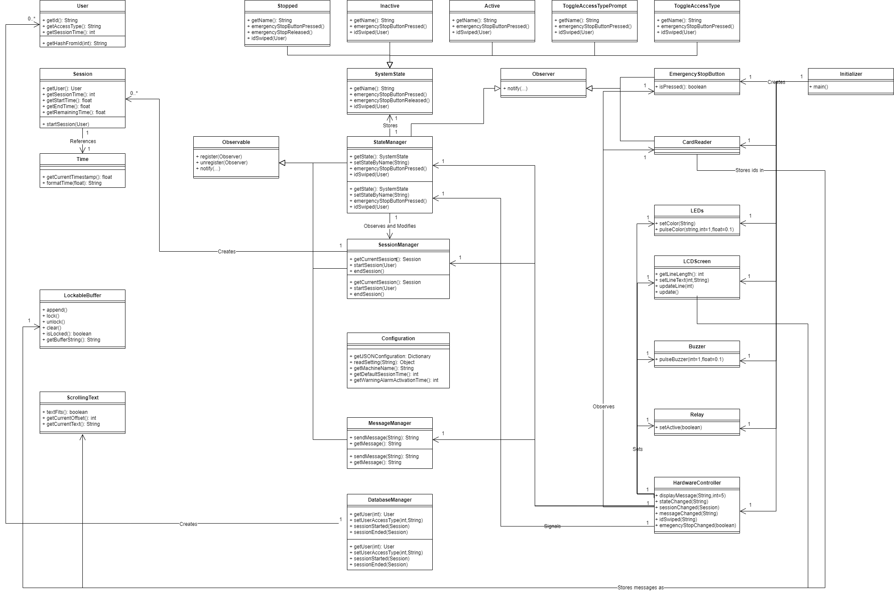

# Machine Swipe System Design Document

## Team Information
* Product owner: The Construct @ RIT
* Team members:
  * Michael Buffalin
  * Zachary Cook
  * Jim Heaney
  
## Executive Summary

### Purpose
The purpose is to be able to authenticate and control who has
access to machines. The is connected to The Construct @ RIT's
databases to manage users, store who used machines, and authorize
users.

## Requirements

### Hardware Requirements
The required hardware to interface with the system include:
- An internet connected Raspberry Pi running Raspbian.
    - Raspberry Pi 3 or Raspberry Pi Zero W.
    - Any other older Raspberry Pi with a USB WiFi adapter.
    - Any Raspberry Pi connected to ethernet.
    - SSH can be enabled for post-deployment changes.
- A mag-stripe reader for reading university id cards. The ones supported are USB and act like a keyboard to the OS.
- 4 line, 20 character per line (4x20) LCD screen for displaying messages.
- A relay for external control of the machine. Typically, this will be for the machine's Emergency Stop.
- An emergency stop button for ending sessions.
- A key switch to bypass sessions. Intended for demos or when the server is offline.

### Configuration
The following need to be able to be configured for the
machine, including:
- Machine internal name (ex: ShopSabreCNCRouter)
- Machine visible name (ex: Shop Sabre CNC Router)
- Session length if the server is offline
- Server endpoint
- Warning alarm activation time in seconds (<0 => no alarm)

### Software Requirements
System States:

| State | Definition |
|-------|------------|
| `Stopped` | The machine is disabled with the E-stop pressed. No sessions can be started. |
| `Inactive` | The machine is disabled with the E-stop not pressed. There is no active session. |
| `Active` | The machine is enabled, and has an active user. |

E-Stop Button:
- When the E-Stop is pressed, the relay will be disabled. The system will enter a `Stopped` state.
- When the E-Stop is released and is in a `Stopped` state, the system will enable the relay and enter either an `Inactive` state.

Key Switch:
- The key will be hooked up to the E-Stop.
    - When the switch is enabled, power will be enabled.
    - When the switch is disabled, power will be disabled

LCD Screen:
- The machine name and active state must be displayed.
- If the system is in an `Active` state, the current user with the time remaining must be displayed.

Mag-Stripe Reader:
- When the system is in a `Stopped` state, swipes must display a message about the state and ignore the request.
- Swipes by unregistered users (in main server) should display an error and ignore session requests.
- When the system is in an `Inactive` state, swipes should create new sessions.
- When the system is in an `Active` state, swiping with the same id as the session should reset the session time.
- When the system is in an `Active` state, swiping with a different id should end the current session and start a new session.
- If the main server is unreachable, an error should be displayed and the fallback session length should be used.

Configuration:
- The configuration must implement the stated configuration fields.
- The configuration should be able to be changed at run time without restarting. A refresh delay is acceptable.

Alarm:
- When the session time goes below the specified activation time, the alarm will sound.
- If the activation time is <0, then the alarm will not be used.

Other:
- The system should be maintain on The Construct @ RIT's GitHub account.
- The system should be written in Python 3.
- The system must use The Construct @ RIT's database system.

## Architecture and Design
All diagrams shown were made in [draw.io](draw.io), and are stored
in `\docs\diagrams`.

### Domain Model

### System States

### Design Patterns
The design patterns used, defined by the "Gang of Four", include:
- Command - HTTP requests are encapsulated to decouple the HTTP requests from the system requests.
- Observer - changes to some model elements will be organized through the observer pattern.
- Singleton - Only one instance of the "services" is allowed to exist.
- State - the state of the system is maintained explicitly, and transitions are managed by the states.

### Summary
The system is designed to use a model-view-controller (MVC)
implementation. The system is divided into the following:
- Model - stores the state of the objects.
- Hardware (aka "View") - interfaces with the hardware based.
- Controller - handles the interface between the hardware and model, as well as changes to the model.

### Class Diagram

### Overview of the Model Tier
The Model Tier primarily consists of data classes. This 
includes the following:
- `User` - Represents a user of the machine. The hash of the
university id should always be present, but the name can be
arbitrary. This case will happen for the server, or any method
to get the name being accessible.
- `Session` - Represents a "time-boxed" session of a user of the
machine. When a session is extended, the session should be overridden
with a new class instead of extending the time limit or changing the
start time. This makes the implementation of observing changes to
the current session easier to implement, and the responsibility of
the observer to either handle or not handle changes in users.
- `LockableBuffer` - Used to store a fixed set of objects (characters),
and can be "locked" to prevent accepting new characters. This is used
directly by the swipe reader to block new swipes from being accepted
while a swipe is being processed.

Also includes is the base `HttpRequest` class. The extended classes
(`GetUserFromHash` and `SessionStarted`) are used to encapsulate
data storage requests. This is done to abstract the implementation
for classes that use the requests, as well as allow them to be
replaced for testing or if the data storage requirements change.

### Overview of the Hardware (View) Tier
The Hardware Tier relies on the Controller Tier to know the
state of the system, but not the other way around. The hardware
has both a production implementation. Since the Controller Tier
doesn't rely on the specific hardware classes, they can be
replaced later. This is also used to make an emulated version
for the command line to test without the hardware. 
The main class used as controller for all of the hardware is the
`HardwareController`, which takes in a set of hardware. The
hardware classes can either be actual objects or mock versions
for testing in a virtual environment (such as `TestingEmulator.py`).
The hardware for the pi include the `Buzzer`, `CardReader`,
`EmergencyStopButton`, `LCDScreen`, `LEDs`, and `Relay`.

### Overview of the Controller Tier
The Controller Tier handles modifications to the system's
state (i.e. the instantiated models). It also abstracts
the implementation requirements for the Hardware Tier.
The primary "managers" that store a state, and also
extend the `Observable` class include:
- `StateManager` - Stores the machine state (`Active`,
`Inactive`, and `Stopped`) and handles calls that would
trigger changes to the state. This includes the emergency
stop button being pressed, being released, and an id being
swiped.
- `SessionManager` - Stores the current session. Sessions
are either created or terminated by `SystemStates`.
- `MessageManager` - Stores the current message to
display. It is up the observer to determine if it
should be constantly displayed until something else
happens, or if it should be shown for a few seconds.

The secondary "managers" don't store a state, so they
just act as mediators. This includes the following:
- `SwipeManager` - Handles ids being swiped as the
raw number for university ids. It handles interfacing
with the database to determine if the user is valid,
and invokes the current `SystemState` if the user 
is able to start a session.
- `DatabaseManager` - Handles getting user information
from the centralized database on the network.
- `ConfigurationManager` - Reads the configuration. Since the
configuration can be changed at any point, each call
will read the current configuration file.

Since states of the system are stored explicitly, the
states are stored in the controller. These include:
- `Stopped` - Represents the Emergency Stop being pressed.
    - Emergency stop is pressed: Nothing happpens (shouldn't happen)
    - Emergency stop is released: Set the state to be `Inactive`
    - Id is swiped: An error is displayed that the machine is stopped
- `Inactive` - Represents the Emergency Stop being released, but no session in progress.
    - Emergency stop is pressed: Set the state to be `Stopped`
    - Emergency stop is released: Nothing happpens (shouldn't happen)
    - Id is swiped: Starts a new session
- `Active` - Represents the Emergency Stop being released and a session is in progress.
    - Emergency stop is pressed: End the current state and set the state to be `Stopped`
    - Emergency stop is released: Nothing happpens (shouldn't happen)
    - Id is swiped: Overrides the session with the new id

### Testing

#### Acceptance Testing
Acceptance testing is done to ensure functionality works
outside of unit tests. The spreadsheet used for testing
is contained in the `tests` directory.

#### Unit Testing
Unit testing is done with the "PyUnit" / unittest framework.
Tests are contained in the `tests` directory.