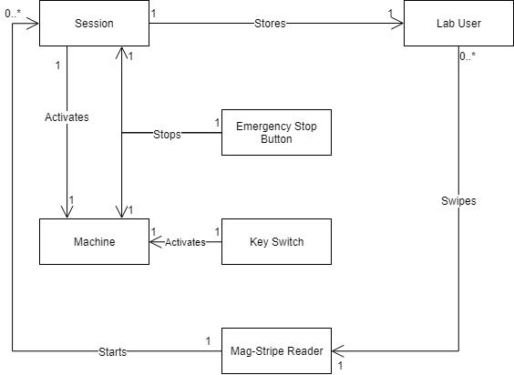
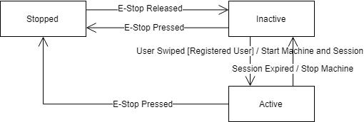

# Machine Swipe System Design Document

## Team Information
* Product owner: The Construct @ RIT
* Team members:
  * Zachary Cook _(Software Engineer)_
  
## Executive Summary

### Purpose
The purpose is to be able to authenticate and control who has
access to machines. The is connected to The Construct @ RIT's
databases to manage users, store who used machines, and authorize
users.

## Requirements

### Hardware Requirements
The required hardware to interface with the system include:
- An internet connected Raspberry Pi running Raspbian.
    - Raspberry Pi 3 or Raspberry Pi Zero W.
    - Any other older Raspberry Pi with a USB WiFi adapter.
    - Any Raspberry Pi connected to ethernet.
    - SSH can be enabled for post-deployment changes.
- A mag-stripe reader for reading university id cards. The ones supported are USB and act like a keyboard to the OS.
- 4 line, 20 character per line (4x20) LCD screen for displaying messages.
- A relay for external control of the machine. Typically, this will be for the machine's Emergency Stop.
- An emergency stop button for ending sessions.
- A key switch to bypass sessions. Intended for demos or when the server is offline.

### Configuration
The following need to be able to be configured for the
machine, including:
- Machine internal name (ex: ShopSabreCNCRouter)
- Machine visible name (ex: Shop Sabre CNC Router)
- Session length if the server is offline
- Server endpoint
- Warning alarm activation time in seconds (<0 => no alarm)

### Software Requirements
System States:

| State | Definition |
|-------|------------|
| `STOPPED` | The machine is disabled with the E-stop pressed. No sessions can be started. |
| `INACTIVE` | The machine is disabled with the E-stop not pressed. There is no active session. |
| `ACTIVE` | The machine is enabled, and has an active user. |

E-Stop Button:
- When the E-Stop is pressed, the relay will be disabled. The system will enter a `STOPPED` state.
- When the E-Stop is released and is in a `STOPPED` state, the system will enable the relay and enter either an `INACTIVE` state.

Key Switch:
- The key will be hooked up to the E-Stop.
    - When the switch is enabled, power will be enabled.
    - When the switch is disabled, power will be disabled

LCD Screen:
- The machine name and active state must be displayed.
- If the system is in an `ACTIVE` state, the current user with the time remaining must be displayed.

Mag-Stripe Reader:
- When the system is in a `STOPPED` state, swipes must display a message about the state and ignore the request.
- Swipes by unregistered users (in main server) should display an error and ignore session requests.
- When the system is in an `INACTIVE` state, swipes should create new sessions.
- When the system is in an `ACTIVE` state, swiping with the same id as the session should reset the session time.
- When the system is in an `ACTIVE` state, swiping with a different id should end the current session and start a new session.
- If the main server is unreachable, an error should be displayed and the fallback session length should be used.

Configuration:
- The configuration must implement the stated configuration fields.
- The configuration should be able to be changed at run time without restarting. A refresh delay is acceptable.

Alarm:
- When the session time goes below the specified activation time, the alarm will sound.
- If the activation time is <0, then the alarm will not be used.

Other:
- The system should be maintain on The Construct @ RIT's GitHub account.
- The system should be written in Python 3.
- The system must use The Construct @ RIT's database system.

## Architecture and Design
All diagrams shown were made in [draw.io](draw.io), and are stored
in `\docs\diagrams`.

### Domain Model

### System States

### Design Patterns
The design patterns used, defined by the "Gang of Four", include:
- Command - HTTP requests are encapsulated to decouple the HTTP requests from the system requests.
- Observer - changes to some model elements will be organized through the observer pattern.
- State - the state of the system is maintained explicitly, and transitions are managed by the states.

### Summary
The system is designed to use a model-view-controller (MVC)
implementation. The system is divided into the following:
- Model - stores the state of the objects.
- Hardware (aka "View") - interfaces with the hardware based.
- Controller - handles the interface between the hardware and model, as well as changes to the model.

### Overview of the Model Tier
(Not typed yet)

### Overview of the Hardware (View) Tier
(Not typed yet)

### Overview of the Controller Tier
(Not typed yet)

### Testing

#### Acceptance Testing
Acceptance testing is done to ensure functionality works
outside of unit tests. The spreadsheet used for testing
is contained in the `Tests` directory.

#### Unit Testing
Unit testing is done with the "PyUnit" / unittest framework.
Tests are contained in the `Tests` directory. Code coverage
isn't measured.